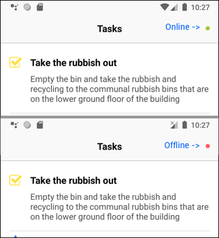
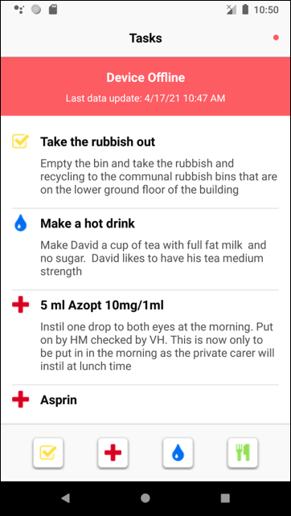
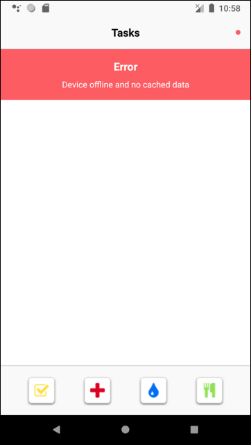
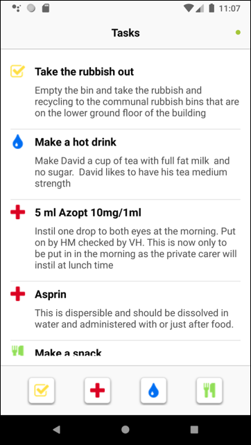
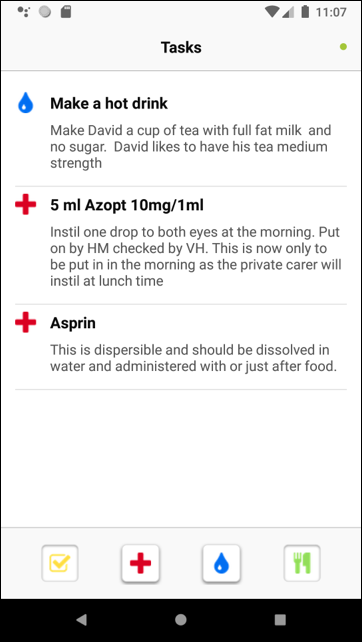

# Tasks Demo
Android Kotlin App using Clear Architecture, MVVM, unit testing and UI testing

The App has been developed using 

- Android Studio 4.1.3 
- Kotlin 1.4.32
- Coroutines 1.4.3

## Business logic
The business logic has been implemented using Clean Architecture

## Presentation
The presentation has been implemented using the MVVM architecture

## Libraries used
Here is the list of libraries used to develop the project:

- Dagger, Hilt
- kittinunf Result
- Retrofit, OkHttp and Gson
- Room

### Dagger, Hilt
Tha App uses Dagger to manage the dependency injection of use cases in the ViewModel

### kittinunf Result
Lightweight Result monad that works seamlessly with coroutines and Mockito: https://github.com/kittinunf/Result

Note: Kotlin Result type is not yet supported by Mockito as explained here https://github.com/mockito/mockito-kotlin/issues/381

### Retrofit, OkHttp and Gson
Library used to access the backend system. The Retrofit provider implemented is able to manage the staging version and the production version of the backend based on the build type. The url is defined in the app build.gradle

The OkHttp libraries logs the communication with the backend when not in 'release' mode

### Room
Room has been used to persist the data received from the remote service.

As an alternative to the database, the local data can be saved as a shared preference (just updating the dependencies in the AppModule file)  

The current implementation of Room is for demonstration purpose only: the data could be saved as json string in a single line of a single table

## UI
The UI has been designed using the standard Android UI, but it has been decompose in components to simplify the management and the delegation of responsibilities.

The background of the filter buttons has been created using png files for the different resolution while a vector image would have been preferred; unfortunately the conversion of the svg files to the xml drawable file had problems with the shadows.

The UI has been changed a little trying to make for visible to the user that the images at the bottom of the activity are filters that can be activated.

The RecyclerView can be refreshed by swiping to the bottom.

The status of the connection is displayed on the left side in the title bar:

  - dot green: the device is online, connected to internet
  - dot red: the device is offline, disconnected from internet
 
 If you refresh the data while the device is offline, a banner will appear containing the message that the device is offline and the last update time of the data displayed (data coming from the cache, of course)
 
 ### Kotlin synthetics
 The app is using 'Kotlin synthetics' to access the XML views even if it has been deprecated in favor of 'Jetpack view binding'. 
 Because in few months we need to start the migration to the released version of 'Jetpack Compose' at this stage we do't need
 to worrier about this deprecation.
 
 Reference: https://developer.android.com/topic/libraries/view-binding/migration
 
 # Screenshots
 Here is how the App is displayed on the device when it's online:
 

 and now when offline:

 the connection status is displayed in the right side of the App bar:

### Realoding from backend
To relaod the data from the backend, swipe downwards the list and wait:

  
but, if the device is offline, a banner will appear containing the message that the data displayed are not coming from the backend but from an internal cache, with the date and time of the last loading from the backend:

### First launch without internet connection
If the device in not connected at the first launch, when there are no data cached, the following error message is displayed:

## Fiters
The data displayed can be filtered using the buttons on the bottom bar. They work on the data displayed without any reload from the backend, so they can be used when the device is online and offline.

When a button is in the 'down' status, the corresponding items in the list will be hidden

### Without active filters

### With active filters

